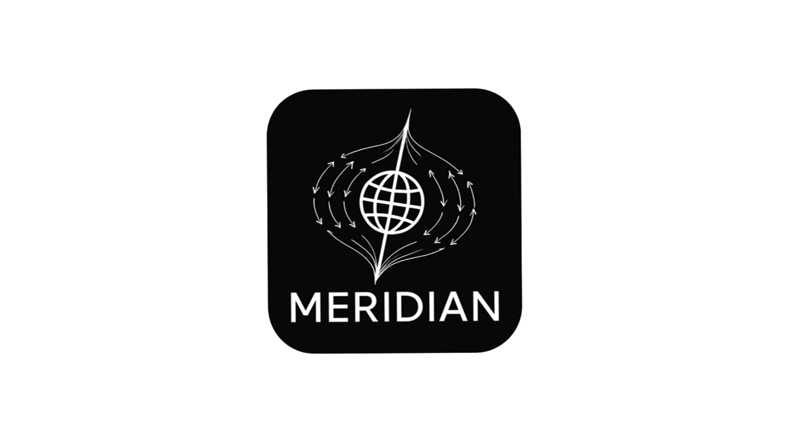

<p align="center">
  
</p>

# Meridian

> The vault is the single source of truth. Any agent reads from it, plans against it, executes, and hands control back through it.

Meridian is a framework for Human↔Agent collaboration. It uses an Obsidian vault as shared state between humans and any AI agent — Claude Code, Cursor, a GPT, a CLI script. Agents don't share memory or APIs. They share the vault.

Like the Prime Meridian (0° longitude, Greenwich) — a universal reference line no single navigator owns, but every navigator adopts. Implement five primitives and you're in. No plugin, no API, no shared runtime.

→ [Full concepts and philosophy](docs/concepts.md)

## How It Works

```
Vault (Projects + Tasks)  ←────────────────────────►  Any Agent (Execution)
        ▲                                                       │
        │  status fields are the only shared state              │
        │                                                       ▼
   Human reviews                                   Reads · Plans · Builds
   & approves                                      Creates review checkpoints
        ▲                                                       │
        └───────────────── vault write ─────────────────────────┘
```

1. **Define** — Human writes a task in a Project note (`owner::agent`)
2. **Pick up** — Agent finds the next `agent/backlog` task for project X
3. **Plan** — A planning artifact (PRD, ADR, RFC…) is produced or loaded via `/mdn-load`
4. **Checkpoint** — Meridian inserts a `owner::me status::review` task pointing to the plan
5. **Approve** — Human reads, edits if needed, runs `/mdn-approve`
6. **Execute** — Agent picks up the approved task and executes against the plan
7. **Review** — Agent creates a verification checkpoint; human confirms or requests changes
8. **Done** — Loop continues from step 2 (or ends here)

## Installation

```bash
# Default (Claude Code)
bash <(curl -fsSL https://raw.githubusercontent.com/user/meridian/main/install.sh)

# For Codex / OpenAI
bash <(curl -fsSL https://raw.githubusercontent.com/user/meridian/main/install.sh) --tool codex
```

Run `/mdn-init` in any Claude Code session to complete first-time setup.

## Quick Start

```bash
/mdn-init name:my-app       # initialize a new project
/mdn-add project:my-app     # add a task
/mdn-load project:my-app path:/path/to/plan.md type:prd   # load a planning artifact
/mdn-approve project:my-app # review, then approve + execute in one step
/mdn-status                 # check status at any time
```

## Skills

| Command | Description |
|---|---|
| `/mdn-init name:<slug>` | First-run setup and project folder structure creation |
| `/mdn-add project:<slug>` | Add a human or agent task to a project |
| `/mdn-load project:<slug> path:<path> type:<type>` | Register a planning artifact and create a review checkpoint |
| `/mdn-approve project:<slug>` | Approve a pending plan and immediately trigger execution |
| `/mdn-run project:<slug>` | Execute the next approved agent task in a project |
| `/mdn-plan project:<slug>` | Auto-generate plan stubs for all unplanned backlog tasks |
| `/mdn-status` | Dashboard: all active projects with task counts by status |
| `/mdn-daily` | Daily brief: everything needing human attention today |
| `/mdn-sync project:<slug>` | Ingest `.md` files from registered source directories as plan notes |
| `/mdn-archive project:<slug>` | Move completed tasks to `tasks/history.md` |

→ [Full skills reference](docs/skills.md)

## Documentation

| Document | Contents |
|---|---|
| [concepts.md](docs/concepts.md) | Vision, philosophy, state machine, agent vs human roles |
| [workflow.md](docs/workflow.md) | Step-by-step guide through the workflow phases |
| [protocol.md](docs/protocol.md) | Agent-agnostic protocol spec — implement your own adapter |
| [skills.md](docs/skills.md) | Full Claude Code skills reference |
| [configuration.md](docs/configuration.md) | Config format, note structure, task syntax, plan format |
