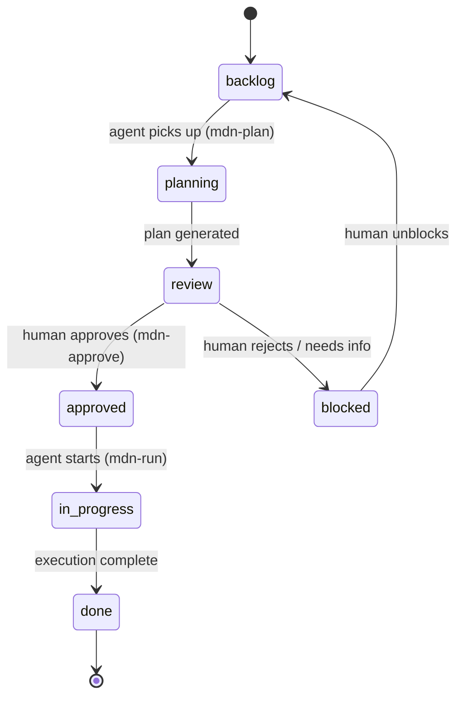

# Concepts

## Vision

> The vault is the single source of truth for every project and task. Any agent — Claude Code, Cursor, a GPT, a CLI script — reads from it, plans against it, executes, and hands control back through it. No agent is required. No agent is privileged.

---

## Why Meridian?

> *"Any navigator, any ship, any era — the meridian doesn't care who's crossing it."*

The **Prime Meridian** (0° longitude, Greenwich) is the universal reference line of every map ever drawn. It doesn't belong to any country or compass — it's a convention that any navigator adopts to locate themselves and communicate position to others.

Meridian — the protocol — works the same way:

- **The vault is the Prime Meridian.** It's the fixed reference every agent reads from and writes to. Agents don't share memory or APIs — they share the vault.
- **Any agent can cross it.** Claude Code, Cursor, a custom GPT, a shell script. The protocol doesn't care. Implement five primitives (READ, GREP, EDIT, INSERT, WRITE) and you're in.
- **"Crossing the meridian"** in astronomy is the moment a star reaches its highest point — maximum visibility, maximum clarity. In Meridian the protocol, that moment is the **review checkpoint**: the instant a plan surfaces from the agent back to the human for inspection before execution begins.
- **Meridians carry flow.** In traditional medicine, meridians are channels through which energy moves through the body. Here, tasks flow through the system — from human intent, through agent planning, into execution, and back as completed work.

Meridian is not a tool. It's a line on the map that everyone agrees to use.

---

## Core Concept

```
Vault (Projects + Tasks)  ←────────────────────────►  Any Agent (Execution)
        ▲                                                       │
        │  status fields are the only shared state              │
        │                                                       ▼
   Human reviews                                   Reads · Plans · Builds
   & approves                                      Creates review checkpoints
        ▲                                                       │
        └───────────────── vault write ─────────────────────────┘
```

The loop:

1. **Define** — Human writes a task in a Project note (`owner::agent`)
2. **Pick up** — Agent finds the next `agent/backlog` task for project X
3. **Plan** — A planning artifact is produced by any external tool (`/mdn-load`) or generated inline by the agent (`/mdn-plan`)
4. **Checkpoint** — Meridian inserts a `owner::me status::review` task pointing to the plan
5. **Approve** — Human reads, edits if needed, runs `/mdn-approve`
6. **Execute** — Agent picks up the approved task and executes against the plan
7. **Review** — Agent creates a verification checkpoint; human confirms or requests changes
8. **Done** — Loop continues or ends

---

## State Machine

Every task moves through a single state machine:



### Agent transitions (automated)

| Transition | Trigger |
|---|---|
| `backlog → planning` | Agent picks up the task (`mdn-plan`) |
| `planning → review` | Agent has produced a plan and inserted review checkpoint |
| `approved → in-progress` | Agent begins execution (`mdn-run`) |
| `in-progress → done` | Agent completes execution |

### Human transitions (manual)

| Transition | Trigger |
|---|---|
| `review → approved` | Human reads and approves the plan (`/mdn-approve`) |
| `review → blocked` | Human rejects or needs clarification (add a **Note:** field) |
| `any → blocked` | Human blocks for external reasons |
| `blocked → backlog` | Human unblocks and resets to queue |

---

## Agent vs Human Roles

Meridian separates work by `owner`:

| Owner | Role | How they act |
|---|---|---|
| `owner::me` | Human | Reads review checkpoints, approves plans, unblocks tasks |
| `owner::agent` | Any agent | Executes tasks, creates plans, transitions states |

The `status` field on each task is the only shared state. Neither side needs to know what runtime the other is using.
