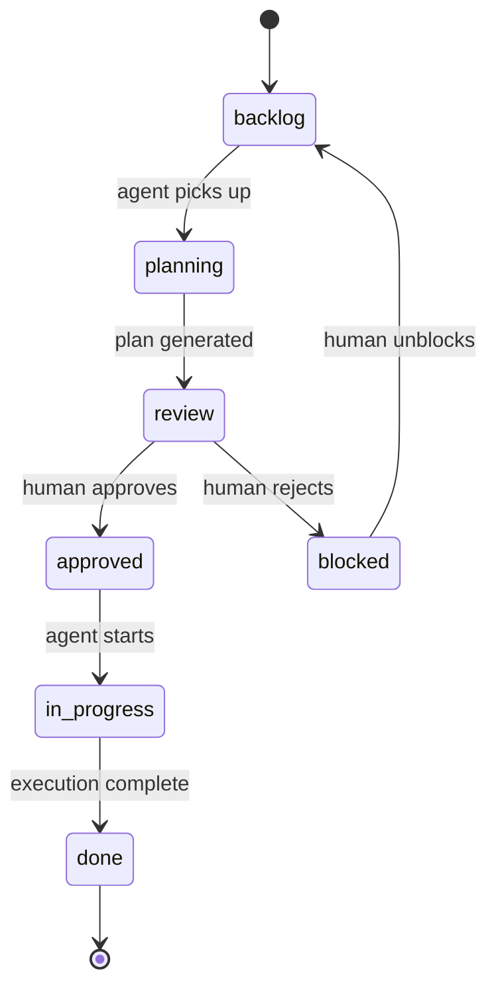

# Protocol Specification

> This document is **agent-agnostic**. Any agent — Claude Code skill, Cursor rule, MCP tool, CLI script, or custom GPT — can implement a Meridian adapter by following this contract alone. No Obsidian plugin, HTTP API, or shared runtime required.

---

## 1. Configuration Resolution

Before any operation, an adapter **must** resolve the vault path:

1. Read `${XDG_CONFIG_HOME:-$HOME/.config}/meridian/config.md`
2. Parse the `vault` field from YAML frontmatter
3. Use that path as the vault root for all subsequent file operations

If the config file does not exist, the adapter must run first-time setup: ask the user for the vault path, write `config.md`, then proceed.

---

## 2. Project Identification

A vault file is a Meridian project if its YAML frontmatter contains:

```yaml
project: <slug>   # kebab-case, machine-readable
status: active    # active | paused | done | archived
```

The filename is **not** canonical — the `project` frontmatter field is. Agents find projects by scanning for `project: <slug>` in frontmatter.

---

## 3. Task Identification

A line is a Meridian task if it matches:

```
- [ ] #task <inline-fields>
```

Immediately followed by indented structured fields:

```
  **Title:** <imperative string>
  **Description:** <free text>
  **Acceptance:** <definition of done>
  **Depends on:** <title or task-id>          (optional)
  **Artifact:** [[<wikilink>]]                (optional — added by agent on review tasks)
  **Note:** <free text>                       (optional — added by agent on completion)
```

---

## 4. Inline Fields

Fields on the checkbox line use `key::value` syntax (Dataview-compatible). Order is not significant.

```
- [ ] #task owner::agent status::backlog type::feature priority::high
```

Parsing rule: extract all `word::word` tokens from the checkbox line using `/\b(\w+)::(\S+)/g`.

| Field | Values | Who sets it |
|---|---|---|
| `owner` | `me` \| `agent` | Author |
| `status` | `backlog` \| `planning` \| `review` \| `approved` \| `in-progress` \| `done` \| `blocked` | Author / Agent |
| `type` | `feature` \| `fix` \| `research` \| `review` \| `chore` | Author |
| `priority` | `high` \| `medium` \| `low` | Author (optional) |

---

## 5. State Machine



**Agent transitions** (automated):
- `backlog → planning` — agent picks up the task
- `planning → review` — agent has produced a plan and inserted review checkpoint
- `approved → in-progress` — agent begins execution
- `in-progress → done` — agent completes execution

**Human transitions** (manual):
- `review → approved` — human reads and approves the plan
- `review → blocked` — human rejects or needs clarification (add a **Note:** field)
- `any → blocked` — human blocks for external reasons
- `blocked → backlog` — human unblocks and resets to queue

---

## 6. Review Checkpoint Protocol

A review checkpoint is created by any of these events:
- `mdn-load` ingests an external plan artifact
- `mdn-plan` generates a plan inline from task description
- An agent completes a task (post-execution verification checkpoint via `mdn-run`)

In all cases, the adapter **must**:

1. Create or update the Plan index note at `<vault>/meridian/<slug>/plans/<plan-name>.md`
2. Add a row to the project note's `## Plans` table
3. If a task was specified (`task:<title>`): update that task `status::planning` → `status::review`
4. Insert a new task immediately below the linked task:

```markdown
- [ ] #task owner::me status::review type::review
  **Title:** Review: <plan title>
  **Description:** <one-line summary of what the plan proposes>
  **Artifact:** [[<plan-name>]]
```

---

## 7. Plan Note (Index)

A Meridian plan note is an **index** — not a copy or wrapper of any artifact. Its job is to orient the reader and point them to every document they need to execute the task well.

Plan notes live at `<vault>/meridian/<slug>/plans/<plan-name>.md`.

**Frontmatter:**

```yaml
---
title: "Plan: <descriptive title>"
created: <date>
project: <slug>
task: <linked task title>          # task this plan belongs to (optional)
status: pending-review | approved | superseded
tags:
  - plan
draft: true
---
```

**Body structure:**

```markdown
> One-line summary synthesizing the task Description + Acceptance into a statement of intent.

---

## Artifacts

| Type | Document | Description |
|---|---|---|
| PRD | [[path/to/prd]] | Full product requirements |
| ADR | [[path/to/adr]] | Architecture decision |

---

## Key Points
- Most important things to know before executing

---

## Execution Order
1. Read the PRD first
2. Then the ADR
3. Start with X

---

## Notes
> Free-form agent/human notes added during review or execution.
```

The **`## Artifacts` table** is the heart of the plan — each row is a reference to an actual document produced by any external tool. `mdn-load` adds rows here. Agents read it to know what to consult before executing.

---

## 8. Completion Protocol

When an agent finishes execution, it **must**:

1. Check the checkbox: `- [ ]` → `- [x]`
2. Update `status::in-progress` → `status::done`
3. Add a **Note:** field with a one-line summary of what was done and any artifact links
4. Create a verification checkpoint task for the human:

```markdown
- [ ] #task owner::me status::review type::review priority::high
  **Title:** Verify: <completed task title>
  **Description:** Agent completed execution. Review the output and confirm it meets acceptance criteria.
  **Artifact:** [[<plan-name>]]
```

---

## 9. Parsing Contract

Any client implementing Meridian needs only five primitives plus config resolution:

```
CONFIG  read vault path from ${XDG_CONFIG_HOME:-$HOME/.config}/meridian/config.md
READ    vault file by frontmatter field  (project: <slug>)
GREP    task lines  /- \[.\] #task/  filtered by inline fields
EDIT    inline field value in-place  (status::X → status::Y)
INSERT  block of lines after a given line number
WRITE   new markdown file at a given vault path
```

No plugin. No API. No shared runtime. Only config resolution + Markdown read/write access to the vault.
