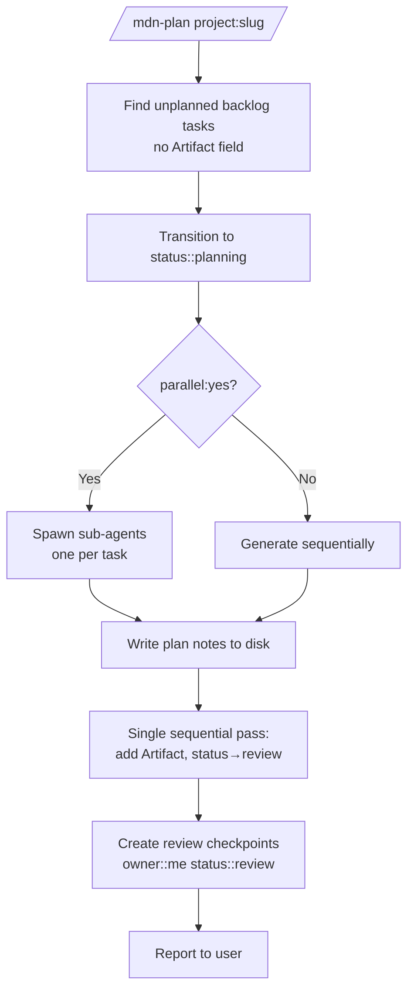
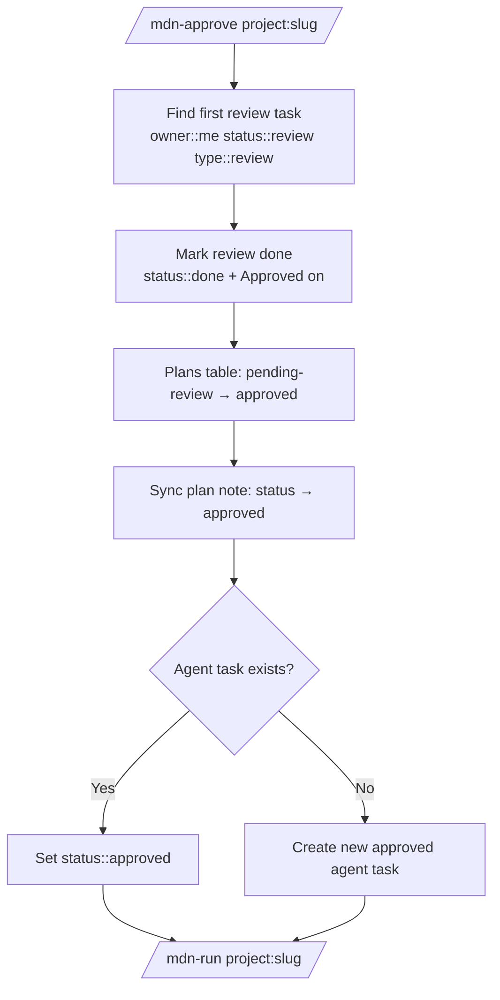
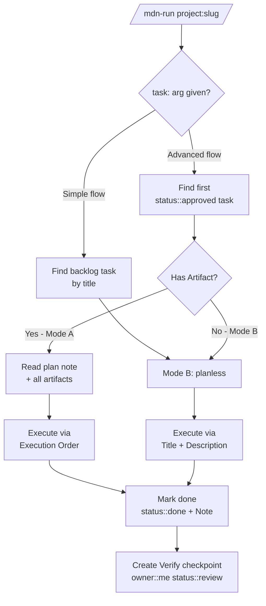

# Skills Reference

Skills are the Claude Code adapter for Meridian. They are Markdown instruction files installed to `~/.claude/skills/` via `install.sh`. Any Claude Code session with those skills installed can invoke them as slash commands.

Other agents implement equivalent adapters for their own runtimes — see [protocol.md](protocol.md).

---

## mdn-init

**Command:** `/mdn-init name:<slug> [title:"..."] [description:"..."]`

First-run setup and project initializer.

On first invocation, detects that no config exists and runs setup: asks for the vault path, writes `~/.config/meridian/config.md`. On every invocation, creates a new project folder structure inside the vault:

```
<vault>/meridian/<slug>/
  PROJECT.md          ← scaffolded project note
  plans/
  tasks/
```

Additional files (`REVIEW.md`, `GOAL.md`, `TASK_HISTORY.md`, `PROGRESS.md`,
`checkpoints/`) are created on demand by the skill that owns them.

**Arguments:**

| Argument | Required | Description |
|---|---|---|
| `name` | yes | Project slug (kebab-case) |
| `title` | no | Human-readable title. Defaults to title-cased slug. |
| `description` | no | One-line project summary. |

---

## mdn-add

**Command:** `/mdn-add project:<slug> [title:"..."] [owner:me|agent] [type:...] [priority:...] [plan:yes] [note:yes|no]`

Add a task to a project. Collects any missing fields interactively. Optionally creates a Plan index stub if the task warrants one.

**Arguments:**

| Argument | Required | Description |
|---|---|---|
| `project` | yes | Project slug |
| `title` | no | Task title (prompted if omitted) |
| `owner` | no | `me` or `agent` |
| `type` | no | `feature` \| `fix` \| `research` \| `chore` |
| `priority` | no | `high` \| `medium` \| `low` (default: `medium`) |
| `plan` | no | `yes` to create a Plan index stub immediately |
| `note` | no | `yes` force task note; `no` suppress it |

---

## mdn-load

**Command:** `/mdn-load project:<slug> path:<path> type:<type> [plan:<name>] [task:<title>]`

Register an external planning artifact as a Plan index note. The artifact can live anywhere — inside the vault, in a git repo, at an absolute path.

After loading, run `/mdn-approve project:<slug>` to approve and execute in one step.

**Arguments:**

| Argument | Required | Description |
|---|---|---|
| `project` | yes | Project slug |
| `path` | yes | Path to artifact (vault-relative, absolute, or repo-relative) |
| `type` | yes | `prd` \| `adr` \| `rfc` \| `spec` \| `dd` \| `research` |
| `plan` | no | Plan index filename (kebab-case). Defaults to artifact filename stem. |
| `task` | no | Exact title of the task this plan belongs to. |

**Examples:**

```
/mdn-load project:my-app path:/home/user/projects/app/docs/prd.md type:prd task:"Build auth"
/mdn-load project:my-app path:./docs/adr-001.md type:adr
```

---

## mdn-plan

**Command:** `/mdn-plan project:<slug> [tasks:all|<n>] [parallel:yes|no] [method:inline|<skill-name>]`

Generate Plan index notes for all unplanned `owner::agent status::backlog` tasks in a project. Uses inline AI reasoning by default; can delegate to a custom skill.



**Arguments:**

| Argument | Required | Description |
|---|---|---|
| `project` | yes | Project slug |
| `tasks` | no | `all` or N (default: `all`) |
| `parallel` | no | `yes` = concurrent sub-agents (default: `yes`) |
| `method` | no | `inline` (default) or a skill name |

---

## mdn-approve

**Command:** `/mdn-approve project:<slug> [plan:<plan-name>]`

Approve a pending review task and immediately execute the plan. Combines the approval step and `/mdn-run` into a single command — no further input needed.



**Arguments:**

| Argument | Required | Description |
|---|---|---|
| `project` | yes | Project slug |
| `plan` | no | Plan name to approve. Defaults to first pending review. |

---

## mdn-run

**Command:** `/mdn-run project:<slug> [task:<title>]`

Execute the next approved agent task. Two flows: advanced (picks up first `status::approved` task) or simple (`task:` arg runs a specific backlog task directly, skipping planning).



**Arguments:**

| Argument | Required | Description |
|---|---|---|
| `project` | yes | Project slug |
| `task` | no | Title of backlog agent task (simple flow — skips planning). |

---

## mdn-status

**Command:** `/mdn-status [project:<slug>]`

Dashboard of all active projects with task counts by status and owner. Highlights items pending human review and agent tasks ready to run.

**Arguments:**

| Argument | Required | Description |
|---|---|---|
| `project` | no | Limit output to a single project |

---

## mdn-daily

**Command:** `/mdn-daily`

Daily brief. Surfaces all tasks needing attention across every active project, grouped by bucket:

- `▸` **Review** (`owner::me status::review`) — plans waiting for approval
- `▲` **High-priority** (`owner::me status::backlog priority::high`) — human items to action
- `■` **Blocked** (`status::blocked`) — items needing unblocking
- `◎` **In progress** (`owner::agent status::in-progress`) — agents currently executing
- `→` **Agent ready** (`owner::agent status::approved`) — agents queued to run

No arguments.

---

## mdn-sync

**Command:** `/mdn-sync project:<slug> [type:<type>] [dry-run:yes]`

Bulk-ingest planning artifacts from registered source directories. Scans all paths listed in `## Sources` in the project note and loads any `.md` files not yet indexed as plan notes.

**Arguments:**

| Argument | Required | Description |
|---|---|---|
| `project` | yes | Project slug |
| `type` | no | Force artifact type for all new files. Default: `spec`. |
| `dry-run` | no | `yes` to preview without writing. |

---

## mdn-archive

**Command:** `/mdn-archive project:<slug>`

Move all `status::done` task blocks from `PROJECT.md` into `TASK_HISTORY.md`. Keeps the project note clean without deleting history. The history file is the permanent record.

**Arguments:**

| Argument | Required | Description |
|---|---|---|
| `project` | yes | Project slug |
