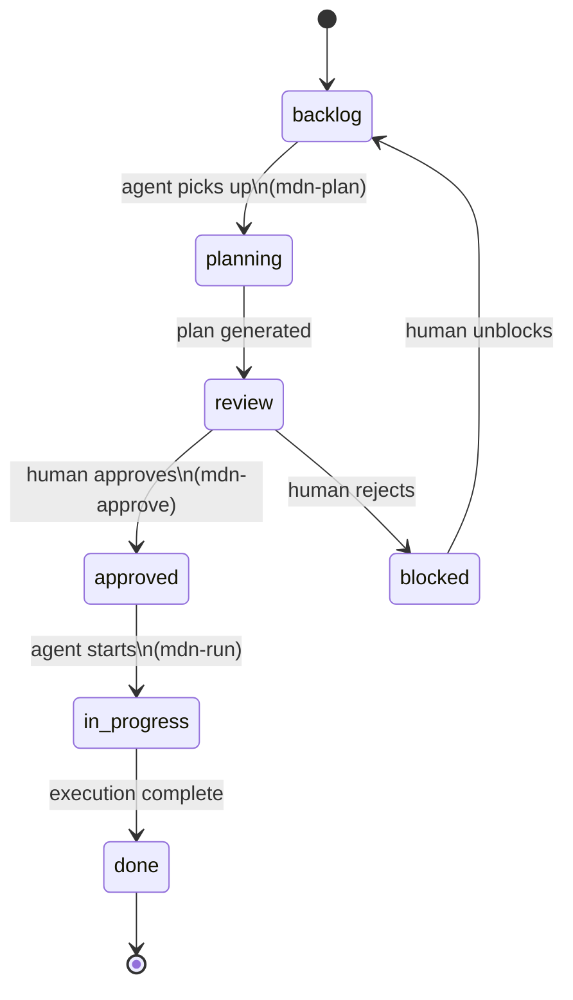
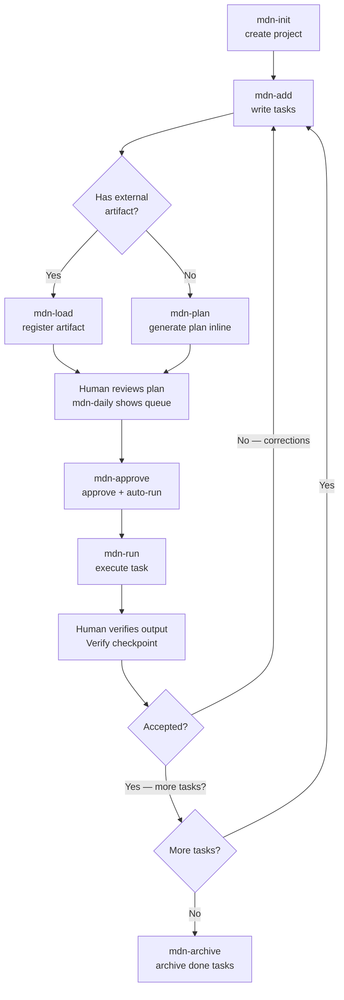

# Workflow

Meridian operates in four phases. Phases 1 and 3 are human. Phases 2 and 4 are agent (or any external tool). The loop between phases 3 and 4 can repeat as many times as needed.

---

## Task State Machine

Every task moves through a single lifecycle:



---

## Project Lifecycle



---

## Phase 1 — Task Definition (Human)

Write an `owner::agent` task in the project note with enough context for an agent to work independently:

```markdown
- [ ] #task owner::agent status::backlog type::feature priority::high
  **Title:** Build authentication flow
  **Description:** Implement JWT-based login and refresh. Use the existing User model. No OAuth for now.
  **Acceptance:** Users can log in, receive a token, and the token refreshes automatically before expiry.
```

A good task has:
- A clear **title** (imperative verb)
- A **description** with intent and constraints
- An **acceptance criterion** — the definition of done

Use `/mdn-add project:<slug>` to add tasks interactively.

---

## Phase 2 — Planning (Human or Agent)

Plans can be created two ways:

**Option A — External artifact:** Use any external tool (Claude in chat mode, Cursor, a PRD template) to produce a planning artifact, then load it:

```
/mdn-load project:<slug> path:<path-to-artifact> type:<prd|adr|rfc|spec|dd|research> [plan:<name>] [task:<task-title>]
```

**Option B — Inline plan:** Let the agent generate a plan directly from the task description:

```
/mdn-plan project:<slug>
```

Both paths produce a **Plan index note** at `<vault>/meridian/<slug>/plans/<plan-name>.md` and insert a `status::review` checkpoint so the human can inspect before execution begins.

| Artifact | Suggested tools |
|---|---|
| PRD (Product Requirements Doc) | Claude in chat mode, any AI assistant |
| ADR (Architecture Decision Record) | Manual, planning-with-files |
| RFC / Spec | Any structured template, custom skill |
| DD (Design Document) | Manual, Cursor |
| Research note | Manual, any AI assistant |
| Inline plan | `/mdn-plan` |

---

## Phase 3 — Review (Human)

You'll see a `status::review` task appear in your project or daily view (`/mdn-daily`):

```markdown
- [ ] #task owner::me status::review type::review priority::high
  **Title:** Review plan: feature-auth
  **Artifact:** [[feature-auth]]
```

Steps:
1. Open the linked Plan note
2. Read the Summary, Key Points, and Execution Order
3. Edit the plan if needed (adjust scope, add constraints, reorder steps)
4. When satisfied, run `/mdn-approve project:<slug>` — this approves the plan **and immediately starts execution**

If you need to block the task instead:
- Set `status::blocked` on the review task
- Add a `**Note:**` field explaining why

---

## Phase 4 — Execution (Agent)

`/mdn-approve` (which calls `/mdn-run project:<slug>`) picks up the approved task and executes it:

1. Finds the first `owner::agent status::approved` task
2. Reads the linked Plan index note
3. Reads all artifacts referenced in the Plan's `## Artifacts` table — wherever they live
4. Executes the task using the Execution Order and artifact content as context
5. Marks the task done (`- [x]`, `status::done`, appends a `**Note:**`)
6. Creates a **verification checkpoint** task for the human:

```markdown
- [ ] #task owner::me status::review type::review priority::high
  **Title:** Verify: <task title>
  **Description:** Agent completed execution. Review the output and confirm it meets acceptance criteria.
  **Artifact:** [[<plan-name>]]
```

---

## The Loop

After Phase 4, the human reviews the agent's work (another Phase 3). This can lead to:

- **Accepted** — loop ends, mark the verify task done
- **Needs changes** — create a new agent task with the corrections, loop continues
- **New work discovered** — add new tasks to backlog, loop continues from Phase 1

The `status` field in the vault is the only coordination mechanism. Neither side needs to know what runtime the other is using between sessions.
